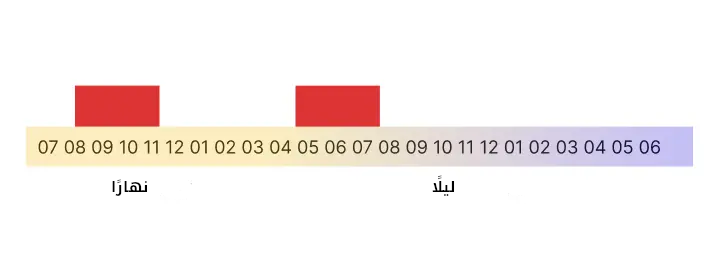
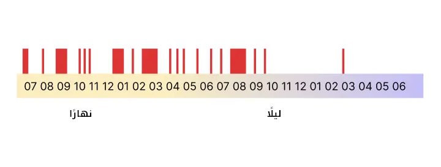
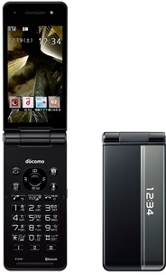

+++
title = "ما يُردّ به العقل: للتيقّظ وقلة الغفلة"
description = "ضيّع الهاتف العقل ففسد الاختيار والتمييز وذهبت النباهة."
[taxonomies]
tags = ["مجتمع", "تقنية"]
[extra]
accent_color = "#48889c"
accent_color_dark = "#48889c"
toc = true
banner = "banner.jpg"
+++

<h2 style="text-align:center">السلام عليكم ورحمة الله وبركاته</h2>

غيّرت «آبل» العالم لما خرّجت جهاز «الآيفون» عام 2007، وأظهرت تقنياتٍ جديدة لم تكن معهودة من قبل. ولصاحبه «سطيف» قول معروف يوم عرضه: الآيفون = حياتك في جيبك.

فأحب الناس الجهاز حبًّا جمًّا، وصار من مفاخرهم. وقد حقّ قول «سطيف» فانتشرت الأجهزة الذكية حتى صارت في كلّ جيب ويد، وعشنا بها وصببنا حياتنا فيها واليوم نحصد سوء عاقبتها.

فلا صرنا نحتمل قراءة الكتب ولا الترويح مع أولادنا وانشغلنا بالإشعارات وأصواتها وأدمنّا تصفح المنشورات الفارغة.
عادة

تفتح هاتفك قبل نومك وبعد نهوضك وفي مشيك وحتى أثناء حديثك مع الناس أمامك فتهرب من واقعك في ضجرك وحزنك وسخطك. وهذا يؤذيك بشيئين.

أولهما، فتح هاتفك في يومك يقطعه مقاطيع. وظنك في استخدامه لبضع ساعات في اليوم يقطعه مقطعين فقط ظنّ باطل.

<figure>

<figcaption> هذا ظنك</figcaption>
</figure>

---

<figure>

<figcaption>هذا فتحك</figcaption>
</figure>

ثانيهما، تُشغل عقلك بما لا ينفع، فترى الرسائل تتوالى، والمنشورات وإعجاباتها، وأخبار تغمّ القلب بمرئياتها، ويتراكم هذا كلّه في عقلك فتفقد تركيزك وتفكيرك فيمَا يُهمك ويُفسد عليك حتى نومك.
فاسترجع مِنْ بدنك مِنَ سآمة ما قد ولَّى عليك من هاتفك، فبادر بما تُرد به نفسك وعقلك فإنّك مُبَادر بك، وجِدّ فإن الأمر جِدٌّ، وتيقظ من رقدتك.

## نُظمٌ لتصحيح ذهنك

### افهم مكانك

تجذّرت الهواتف الذكية في يومنا، فانظر في «[**مدة استخدام الجهاز**](https://support.apple.com/ar-sa/108806)» إن كان جهازك «آيفونًا»، وفي «[**الرَفَاهيَة الرقمية**](https://support.google.com/android/answer/9346420?hl=ar)» إن كان بنظام «آندرويد»؛ فسترى ما يفاجئك.
ولا علم لي بمصدر صحيح دقيق يُثبت المعدل اليومي لاستخدام الهاتف، إلا أن المتكرر في البحوث قرابة الثلاث ساعات كل يوم.
وهذه الساعات اليومية تُساوي شهرًا في السنة وأنت تحملق في شاشة هاتفك. وإن زادت أربعًا! فكأنها شهرين في السنة. وهذه عادة لا تقدر على تتداركها إلا بضدها، ولتنتقل منها حسبك الآتي:

### أزل أغلب البرامج

ما الهاتف إلا أداة فيها ما يُذهل  ذهنك ويُدمنه؛ فأزل ما لا يُفيدك في عملك من البرامج ولا يؤخرك. ولا ينفعك  حدّ ساعاتك وتقييدها على الهاتف، فأزلها من أصلها خيرٌ لك حتى لا تكون  حليمة أمثالنا.

في خروجك دع هاتفك في دارك ولا تحمله معك. لا تخف! جربها يومًا حتى لربع ساعة، واجعلها عادةً فيك وزد فيها كل خرجةٍ.

كن في هذا لأسبوعين أو ثلاثة، ثم قارن أرقامك الأولى بالجديدة في ««مدة استخدام الجهاز» أو «الرَفَاهيَة الرقمية».
وإن ارتحت بها وارتضيتها لك حالًا فاقفز لما بعدها.

### استخدم هاتفًا قديمًا

<aside>

النوع الذي اشتريته

</aside> 

يُسميه الناس بـ«الهاتف الغبي» وأنا عندي «اليسير». وهو أفضل من ابن عمه «الذكي»، -وإن كان ذكيَّا- إلا أن  خوارزمياته لا همّ لها بك، المهم عنده أن تقضي أكثر وقتك عليه فيسحب منك  طاقة ذهنك ووقتك في تفاهاتٍ ليُريك إعلاناتٍ يأخذ مالها صاحبه.

وأما «اليسير» فيه مهم المهم، فبه  تقدر على الاتصال وإرسال الرسائل وقد يكون فيه ما يزيد على هذا، كحاسبة  وعدسة ضعيفة للتصوير، كهواتف «نوكيا» القديمة.

وقد أخترت من «**[أينما كنت](https://www.docomo.ne.jp/)**» جهازًا ليكون هاتفًا لي، وفيه من الميزات ما يفوق أجهزة نوكيا (وبعضها لا  يشتغل إلا في بلده أصلا) إلا أن لي أسبابي في اختياري، فلا أنصحك به. فإن  لقيت هاتفًا به ميزات تصلح لك كالخرائط، فنوكيا عندها أجهزة بهذه الميزات  وبعيدة عن خوارزميات «الذكي».

### جِد أبدال لما فقدت

لا تحن لهاتفك الذكي إن أردت شيئًا  لم تلقه في هاتفك اليسير، جِد أداة أو طريقًا آخر يُغنيك عن الرجوع إليه،  ولا تدع الشيطان يُزين لك سهولة وصولك لحاجتك قبل انتقالك هذا. وصحيح،  فـ«اليسير» مغيّر لمعايش الناس؛ فإن أردت الدفع به في الدكاكين لن تقدر،  ولن تندري بالمناسبة القادمة قبل حصولها، ولكن لكل هذه حل. فلا تيأس وتذكر  كيف كنّا.

### ما يُكتسب بالانتقال إلى «اليسير»

سيزداد تركيزك. وستحترم مُحادثك خلال كلامه بالاستماع له، كما أن ساعةً تُضاف في يومك تقرأ فيها ما يُفيد دنياك وآخرتك.
ستكون منغمسًا في عملك متواصلًا دون انقطاع، فتقضي وتنجز ما تريد.
يصفى عقلك وتحل السكينة عليك بإذن الله.
عندك ساعتين أو أكثر كل يوم تفعل فيها ما تحب!

## الحاصل

كل ما يُذهلك عن نفسك، وعن زمنك وحاضرك، وعن عملك لغدك؛ عدوُّك. 
يسرقُ العمر منك، يتخطَّفهُ لحظة  تلو اللحظة، يوما بعد اليوم، أسبوعا بعد الأسبوع. وهذا هاتفك، يحبسُكَ في  دوائر مفرغة! شيطان لعينٌ! هو أعدى أعدائك. 

فلا تصادقه!