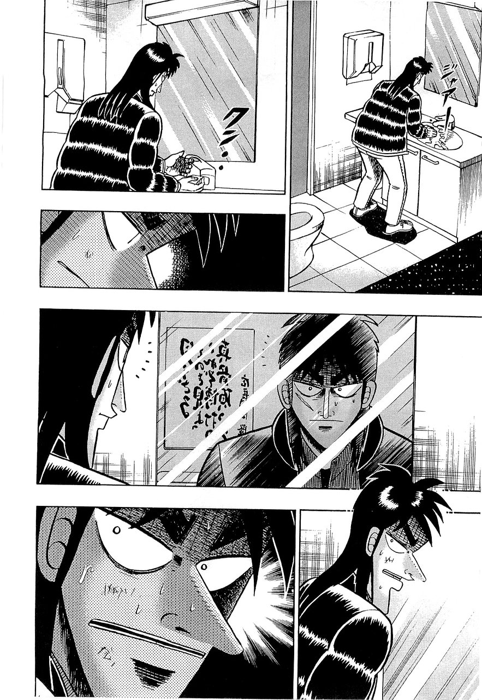

+++
title = "الكَنِيفُ"
description = "مقال في ما يُستفاد من الذهاب للكَنِيف."
[taxonomies]
tags = ["يابانيات"]
[extra]
accent_color = "#a4986c"
accent_color_dark = "#a4986c"
banner = "banner.jpg"
+++

<h2 style="text-align:center">السلام عليكم ورحمة الله وبركاته</h2>

<figure>

<figcaption>العاكس على المرآة: «انظر لسرّ الشيء لا وجوده»</figcaption>
</figure>

كثيرًا ما يدخل &laquo;كَيْجِي&raquo; للكنيف أثناء أشواطه فيزيد ثباته وشدّته فيه ويكون أدوم في حربه على عدوه وأقرب إلى الغلب.
فبه أصاب المكيدة ورأي الحرب لهزيمة «هِيُودُو» لما داس -صُدفةً- على صندوق المناديل. فالاختلاء سبب من أسباب تهوين معاناة القلوب وانبساط النفوس والتفكير في الرأي الحسن.

والكنيف دار ساترة لك عن أعين الأعداء، لتُدبر أمرك وتتحايل فيه. وهذا فعل «كَيْجِي»، فأقام المكائد مع رفاقه وغش في أشواطه وقطع أذنه فيه فلم يدري أعداءه ما يصنع لاستخفاءه به.

 وللكنف مرايا، وأراها أثرت في «كَيْجِي» الأثر البين. فقد أقامت معلّمة من جامعة «تافتس» تجربة ضمّت 34 طالبًا. وزّعتهم في  غرفتين -إحداها دون مرآة- واستأذنت مغادرةً الطلبة فيهما لتعرف أيُّهما يحبس أكثر.
فأقام من في غرفة المرآة 17 دقيقة قبل خروجهم، وأقام من بدونها 22 دقيقة.
فتحقق بالمرآة رشدهم ووعوا أنفسهم وظنّوا سخف انتظارهم فخرجوا وسارعوا لمناداة المعلّمة. فبالمرآة يكون حكمك واضحًا لا وهم ولا ضعف فيه، ذلك لأنها تغلب النرجسية وتُمسكها.

فالكنيف مفيد لحامي الطبع وبمرآة أنجع ليُدرك نفسه ويظفر بالفوز. وبالاختلاء تتجدّد بعد إخْلاقِك، <a href="https://dorar.net/h/quZeiktB" target="_blank">والوضوء يُذهب غضبك</a> كما يُبرّد الماء النار.
