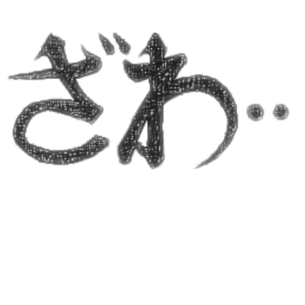

+++
title = "الزَّوْزَوَةُ"
description = "زوّا عليه الفيل. :)"
[taxonomies]
tags = ["يابانيات"]
[extra]
scripts = ["audio.js"]
accent_color = "#5c7ca4"
accent_color_dark = "#5c7ca4"
banner = "banner.jpg"
+++

<h2 style="text-align:center">السلام عليكم ورحمة الله وبركاته</h2>

 {{ audio(url="zawa.opus", name="الزَّوْزَوَةُ") }}: تعبير يكون في أوقات عصيبة غريبة لم تعهدها. وهي **زَوَ** وتتبعها **زَوَ** أخرى. 

وأصلها في أعمال الأستاذ [**النُّبَيْقِي فُقْمَاطُ**](https://ja.wikipedia.org/wiki/%E7%A6%8F%E6%9C%AC%E4%BC%B8%E8%A1%8C)، وهو صاحب «[**アカ ～闇に降り立った天才～**](https://web.archive.org/web/20070629121624/http://www.vap.co.jp/akagi/)» و«[**賭博黙示録カイジ**](https://annict.com/works/588)» وكثيرًا ما يكتبها ويُعبّر بها في قصصه.

وتُرسم بلون داكن. وتُكتب أحيانًا بخط شبيه بخط «[**الصباح**](https://fonts.google.com/noto/specimen/Noto+Serif+JP)». ويتبعها ثلاث نقط تفصل بين الأولى والثانية (زَوَ... زَوَ...) وتُلصق أحيانًا (زَوَ زَوَ...)؛ وفي الخط الياباني تكون النقطة أعلى (・).