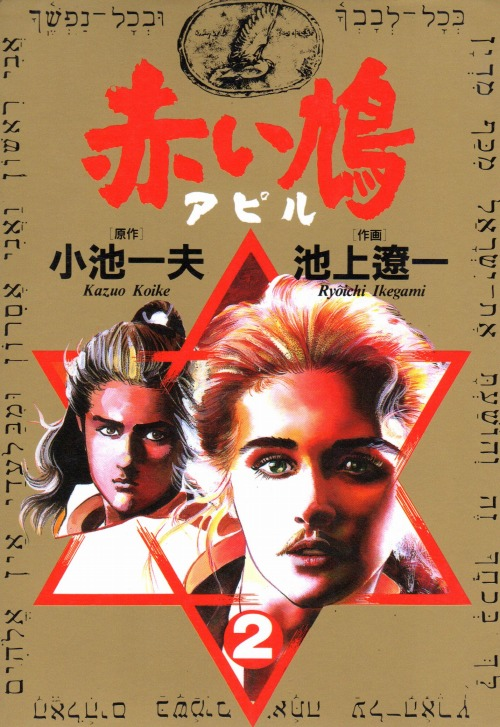
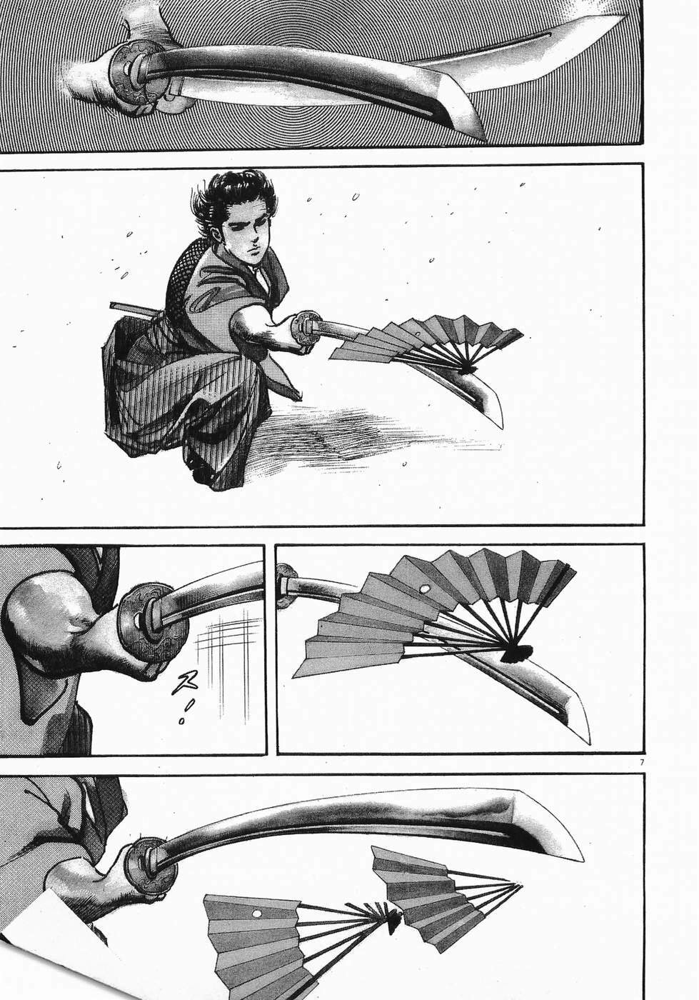

+++
title = "الحمامة الحمراء - 赤い鳩"
description = "حكاية بحث عن أدلة لإثبات قرابة اليابانيين باليهود."
[taxonomies]
tags = ["يابانيات", "قصة مصورة"]
[extra]
banner = "banner.jpg"
accent_color = "#885050"
accent_color_dark = "#885050"
+++

<h2 style="text-align:center">السلام عليكم ورحمة الله وبركاته</h2>

<aside>

<figure>
   
  
  <figcaption>غلاف الفصل الثاني.</figcaption>
</figure>

**صنفها**: تاريخيّ

**كتابة**: [كَزُو كُويْكِ](https://web.archive.org/web/20150721173351/http://www.koikekazuo.jp/) 

**رسم**: [رِيُويْتشِي إِيكِغَمِي](https://mangaseek.net/person/138.html)

**نشر**: [دار شُوغَكُ](http://www.shogakukan.co.jp/)، 1988.

</aside>

هي قصة موضوعة عن سعي داعية -بشنب- [^1] لإثبات قرابة بين أهل اليابان واليهود وأنهم سبط من أسباطهم <small>([وهذه حكاية من الأكاذيب](https://ar.wikipedia.org/wiki/%D9%86%D8%B8%D8%B1%D9%8A%D8%A9_%D8%A7%D9%84%D8%A3%D8%B5%D9%84_%D8%A7%D9%84%D9%8A%D8%A7%D8%A8%D8%A7%D9%86%D9%8A_%D8%A7%D9%84%D9%8A%D9%87%D9%88%D8%AF%D9%8A_%D8%A7%D9%84%D9%85%D8%B4%D8%AA%D8%B1%D9%83))</small>، ويُرافقها <abbr title="ساموراي">محارب ياباني</abbr> من أصحاب أسلوب الدّهْيُ المَنِيَوي [^2]، مهتمُّ بأمر معركة تلّ المتسلم [^3] ومستعظمًا لشأنها، فتبدأ مهمتهما ببحثهما عن أذن عجّل السامريّ المُذهّب لإثبات ما يسعيان إليه. 

وفي القصة إكراه على نظرية قرابة أهل اليابان واليهود، يحشرها الكاتب في وجهك مُصدقًا بها حتى بانت فيه الماليخوليا [^4].

والرسم حيّ جميل، أمّا القصة فغير مفهومة ولا بينة لم تظهر جمال الرسم الذي شُكّل بها. وأكبر ما يعيبها وينقصها غياب عدوّ مرعب قوي. فلم يُصوّر لنا الكاتب تنظيم أصحاب الشمال ولا كبرائهم، وهم أعداء لأبطال القصة؛ فظلّوا يُحاربون صغائر الأعداء في رحلتهم مرّة في كلّ مكان ينزلون فيه، وهذا هو.

فلم يُفلح العمل إلا في الرسم. وضاعت القصة في غاية لا تُدركها.

وضاع وقتي فيها، وعلى ما فيها من رسم حسن، لم تُعجبني.

## الحكم

- [x] مملولة
- [ ] ممتعة
- [ ] أوصي بها

[^1]: واسمها حِبورن، على اسم النصراني [يعقوبس حِبورن](https://ar.wikipedia.org/wiki/%D8%AC%D9%8A%D9%85%D8%B3_%D9%83%D9%88%D8%B1%D8%AA%D9%8A%D8%B3_%D9%87%D9%8A%D8%A8%D9%88%D8%B1%D9%86)، وهو من قابل الأصوات اليابانية بالأحرف اللاتينية، وكان صاحب فضل كبير في تقوية  العلاقة بين الولايات المتحدة الأمريكية واليابان. ولم يُذكر في الحكاية سبب رسمه على هيئة امرأة بشنب. وينبزونها بالمُشْعِرة.

[^2]: 馬庭念流: هو [مذهب من مذاهب القتال يابانية](https://ja.wikipedia.org/wiki/%E9%A6%AC%E5%BA%AD%E5%BF%B5%E6%B5%81). وضعه «هِيغُتْشِي» عام 1591، وسُمّيَ بالمَنِيَويُّ نسبةً لبلده. ([مقطع مرئي)](https://youtu.be/DFX0kCbFu6g). و[أسلوب الدَّهْيُ](https://ja.wikipedia.org/wiki/%E5%BF%B5%E6%B5%81) قائم على إصابة الرأي عند المفاجأة، فعمدة مذهبهم: <q>إن قُطعت يُمناك، فاضرب بشمالك، وإن قُطعت شمالك، عضّ سيفك بالنّواجذ.</q>

[^3]: ذُكر هذا التلّ باسم «أرمقدون»، وهو موقع تتجمع فيه الجيوش لمعركة كبرى آخر الزمان؛ أمَا عندنا فهي الملحمة الكبرى.

[^4]: عند الأدباء، فإن السّوداء يشير إلى <q>
التلذذ بالحزن الخفيف الذي يتولد من تذكر السعادة الماضية أو من تصور الأحلام التي لا يعقبها التحقيق.</q>
