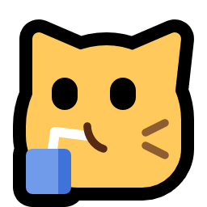
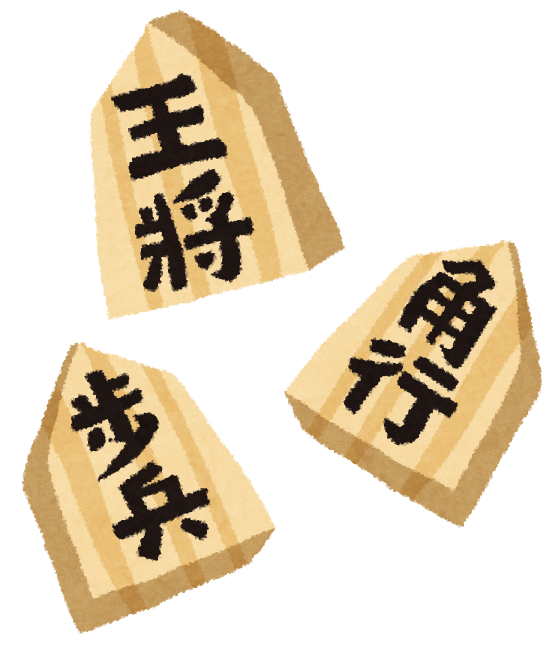
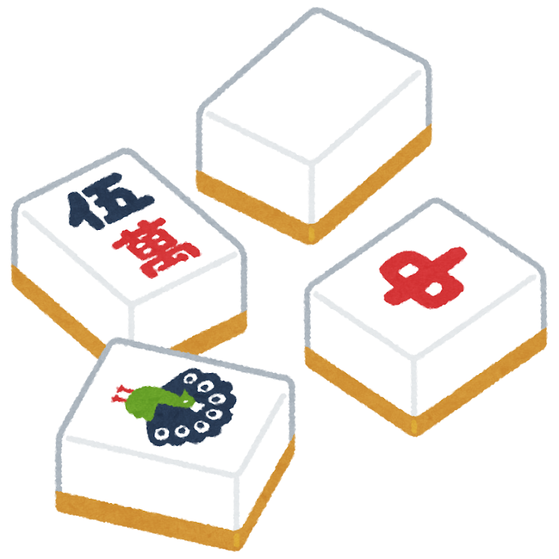

+++
title = "شرح الورد لإمتاع الفرد"
description = "شرح لأشياء مختلفة."
[extra]
styles = ["hana/hana.css"]
+++


شرحٌ لا وردَ فيه.

وقع هذا السجع على خاطري فاسترحت به نفسي وتلذذ به سمعي وكان دون تكلّفٍ فارتضيته اسمًا لما أشرح.

وهنا أجمع ما شرحت وفصّلت ليكون في مكانٍ واحد يسهل إيجاده وحفظه. وهو في فنون مختلفة. <small>ومن طريف الاتفاق أن أوّل شرحين من ألعاب بلاد مطلع الشمس.  </small>

***

<a href="https://fulanumoto.github.io/shogi/">

<strong>将棋</strong>

شوغي: الشطرنج الياباني

</a>

<a href="https://majan-ar.neocities.org/">

<strong>麻雀</strong>

الماجان: لعبة الأحجار

</a>

