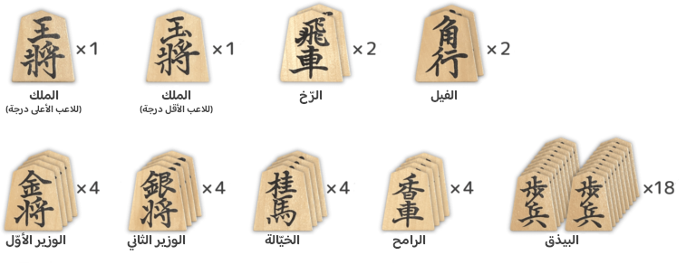

+++
title = "المقدّمة"
description = "أبجديات اللعبة."
[extra]
accent_color = "#d8ac6c"
accent_color_dark = "#d8ac6c"
toc = true
banner = "banner.jpg"
+++

<h2 style="text-align:center">السلام عليكم ورحمة الله وبركاته</h2>

كما بدأت سلسلة شروح [الماجان](https://majan-ar.neocities.org/) قبلًا، أبدأ جديدةً هنا للـ«شُوغِي» أو «شِطرنج الأمراء» [^1] .

فشطرنج الأُمراء هو لعبةٌ يابانيّة تلعب على رقعة ذات واحد وثمانين مربعًا، تمثل دولتين متحاربتين بأربعين قطعة تمثل أمِيرَيِّ  الحرب، ورِخَخَة [^2]  وفيلة ووزراء وخيّالة ورامحة وبياذقة [^3] .

## ملخّص اللعبة

* **عدد اللاعبين:** اثنان

* **القصد:** هزيمة ملك الخصم

* **مدتها:** من نصف ساعة إلى ساعة

وأحيانًا تكون المباراة الرسمية بين أهل الصنعة في يومين. أما غيرهم من العامة فتُلعب في أقل من ساعتين.

## ضروريات اللعبة

* **الرقعة:** واحدة

* **حاملة القطع:** اثنان

* **القطع:** أربعون قطعة

&nbsp;

### الرقعة

 لوحة مُقسّمة إلى 81 مربعًا، 9 عموديةٌ وأخرى مثلها أُفقية. 

&nbsp;

&nbsp;

&nbsp;

### الحاملة

يُوضع عليها ما أُخذَ من قطع الخصم. ويُجعل في مكانها -في حال عدمها- صندوق مقلوب. ويَصحُّ اللعب بدونها.

&nbsp;

&nbsp;

### القطع

9 أنواع بمجموع 40 قطعة.

&nbsp;

&nbsp;

&nbsp;

---

<figure>

  <figcaption>أسماء القطع وأعدادها</figcaption>
</figure>

## سير اللعب

* ترتيب القطع على الرقعة

* اختيار السابق واللاحق

* تبدء اللعبة من تحريك أوّل قطعة

* تنتهي اللعبة بكشّ ملك من الملكين

### ترتيب القطع

رتّب القطع كما في الصورة؛ باتجاه يُقابل الخصم. <small>وللترتيب قاعدة سأذكرها لاحقًا. ولا يحتاجها من بدأ الآن.
</small>

### اختيار السابق واللاحق

والاختيار يكون لتحديد من يُهاجم أولًا ثم يتبعه الآخر ثانيًا. وأصل الاختيار يكون **بإلقاء القطع**. فيُلقي اللاعبان خمسة بياذق بالدور، فإن جاءت أكثرها على وجهها يكون صاحبها المهاجم الأول ويكون الآخر المهاجم الثاني إن جاءت أكثر بياذقه على ظهرها. ويصح التحديد بحجرة ورقة مقص.

وبعد الاختيار والتحديد يُسلّمان انحناءً لبعضهما ثم تبدأ اللعبة.

### اللعب المتناوب

تُلعب بالدور وفي كلّ دورٍ إما أن تُحركَ قطعةً أو تُدخل أخرى قد أخذتها من خصمك. (وفي هذا يختلف الشطرنج اليابانيّ عن العادي المعروف)

* **تحريك قطعة**:
والتحريك يكون لقطعك، ولكلّ قطعة حركة محدّدة.

وإن حركّتها لمربع فيه قطعة الخصم، تأخذها وتضع قطعتك مكانها. ويُسمونها أحيانًا بـ«الأكلة». ثم تضعها على الحاملة احتفاظًا بها. وينتهى دورك.

* **إدخال الأسرى**:
يُمكنك إدخال قطعة قد أخذتها/أسرتها من خصمك ووضعها في أي مكان فارغ واللعب بها في جيشك.

وما إن تُدخلها ينتهي دورك.

* **اللعب شرطٌ**:
لابّد لك من اللعب، إما بتحريك قطعة أو إدخال أخرى.

### الفوز بكش الملك

أوّل لاعبٍ يُهدّدُ ملك الخصم يفوز اللعبة.

[^1]: لاختصاص اسم الأمير بصاحب الحروب والجند وما يرجع إليها ويده مع ذلك عالية على أهل الرّتب وأمره نافذ في الكلّ إمّا نيابة أو استبدادا. <mark>(مقدمة ابن خلدون)</mark>

[^2]: قال الليث: <q>الرُّخ معرب من كلام العجم من أدوات لعبة لهم</q>. <mark>(التهذيب 6:567)</mark>. وقال الصغاني: <q>الرُّخّ من أدوات لعبة الشطرنج، فارسي معرب، والجمع: رِخَخَةٌ مثال قِرَدة</q> اهـ. ذكره ابن منظور غير أنه قال <q>إن جمعه رِخاخ.</q>

[^3]: وهو الجندي الراجل. أورده الأزهري في التهذيب، والصغاني وابن منظور والفيروزابادي. ورد في الحديث بمعناه اللغوي، ففي حديث مسلم أن النبي -صلّى الله عليهم وسلّم- <q>جعل أبا عبيدةَ على البياذقة</q> أي يومَ فتح مكّةَ. المعاجم التي أوردته ذكرت أنه يجمع على بياذِقةٍ، ولم تزد، غير أنه ورد في شعر الفرزدق بياذق بغير الهاء. قال: <q>منعتُك ميراث الملوك وتاجهم ... وأنت لِدِرْعي بيذقٌ في البياذقِ</q>. وعلى هذا البيت لم يذكر الجواليقي في جمعه غير البياذق. <mark>(المعرب: 210)</mark>.

