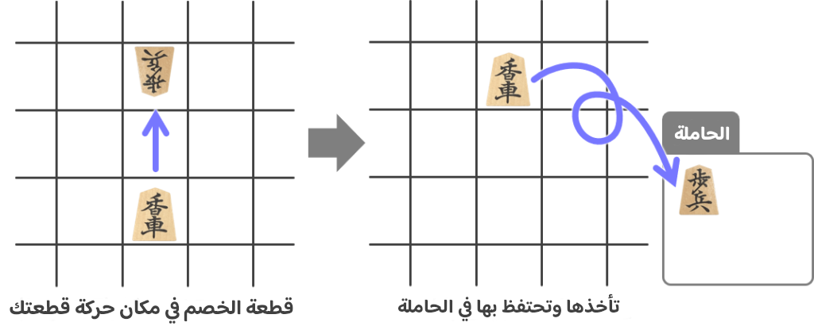

+++
title = "حركات القطع"
description = "شرح عن أسماء القطع وحركاتها."
[extra]
accent_color = "#d8ac6c"
accent_color_dark = "#d8ac6c"
toc = true
banner = "banner.jpg"
+++

<h2 style="text-align:center">السلام عليكم ورحمة الله وبركاته</h2>

في هذا الدرس سأكتب شرحًا عن أسماء القطع وحركاتها.

## صورة لأنواع القطع وحركاتها
 
هذه صورة مختصرة لحركات القطع لتكون عونًا لك في تعلّمك.
 
<figure>

  <figcaption>افتحها في نافذة جديدة واحفظها عندك.</figcaption>
</figure>

## أنواعها

للقطع رموزٌ على وجهها وظهرها

وتُوضع القطع وسط المربع، لا على الخطوط كما في لعبة «غو».

## حركتها

### الملك

يتحرك الملك **مربعًا واحدًا في كل مربع محيطٍ به**؛ وليس له رمز على ظهره فلا يُقلب (أي لا يترقى).

> أُفضّل اسم الأمير على هذه القطعة -كما ذكرت في مقدمة ابن خلدون-، غير أنني جعلته ملكًا مقاربةً
 لقطعة الشطرنج المعروف.

###  الرّخ | التنين

يتحرك الرّخ **لأي مربع أردت أُفقيًا وعموديًا**؛ وإن ترقّى لتنين **فنفس حركات الرّخ ومربع واحد قطريًا زيادةً**. 

>ومعناه العربة الطائرة وفي الترقي الملك التنين

### الفيل | الأدهم

يتحرك الفيل **قطريًا لأي مربّع أردت**؛ ويتحرك الأدهم **مربعًا واحدًا لأي مربع محيطٍ به زيادةً عن حركات الفيل**.

>ومعناها في لغتهم حركة زاوية، وفي الترقّي مُشكّلٌ من رمزي التنين والحصان ويُترجم للحصان الأصيل، ونقلته أدهمًا لقول العرب «مُلوكُ الخَيْل: دُهْمُها.». وصار الفيل حصانًا  .

### الوزير الأوّل

يتحرك الوزير **مربعًا للأمام ومتيامنًا ومتياسرًا ومربعًا واحدًا على جانبيه وواحدًا خلفه**؛  وليس له رمز على ظهره فلا يُقلب.

>ومعناه في لغتهم قائد من ذهب.

### الوزير الثاني | الحاجب

يتحرك الوزير الثاني **مربعًا واحدًا متيامنًا ومتياسرًا من أمامه ومن خلفه**؛ وإن صار حاجبًا فيتحرّك مثل الوزير الأوّل.

> ومعناه في لغتهم قائد من فضّة، وفي الترقي معناه فضّي مُترقٍّ. وقد نقلته حاجبًا لارتفاع مرتبته في دولة المسلمين، فيحجب السلطان عن الخاصّة والعامة وكان في فترة واسطة بين السلطان والوزراء، حتى صار في دولة الموحدين من أرفع الرتب وجُمع له السيف والحرب ثم الرأي والمشورة. 
 
### الفارس | الفارس المُترقّ

يتحرك الفارس **مربعين متيامنًا ومتياسرًا للأمام فقط**؛ وإن ترقّى فيتحرّك مثل الوزير الأوّل.

>وهو نفس المعنى في لغتهم، ويُسمى الحصان في الشطرنج وله نفس الحركة.

### الرّامح | الرامح المُترقّ

يتحرك الرّامح **لأي مربع أمامه**؛ وإن ترقّى فيتحرّك مثل الوزير الأوّل.

>وفي لغتهم له عدّة معاني، منها: سيّارة جيدة -بنطق آخر- وبنفس الرسم والنطق = نسوة بيت الريبة، وهذا قديمًا.

### البيذق | البيذق المُذهّب

يتحرك البيذق **مربعًا واحدًا للأمام فقط**. وإن تذهّبَ فيتحرّك مثل الوزير الأوّل.

>وهو نفس المعنى في لغتهم، وفي الترقّي معناه (صار ذهبًا). فيبدقُ الشطرنجِ من فورِهِ ... يعودُ بالتَّجوْالِ فرزانا

## حركات زيادة 

### متى تُقلب/تترقّى القطعة؟

تُلعب القطع بوجهها بدايةً، و**إن دخلت معسكر العدو قُلبت (ترقّت)**، ومعسكر العدو هو **أوّل ثلاثة صفوف** من الخصم.

### لا تتجاوز القطع بعضها

<figure>

  <figcaption>لا يُسمح عند نقل قطعة بتجاوز أخرى، إلا الفارس، فيقفز ويتجاوز.</figcaption>
</figure>

### الأكل والأخذ

إن حركّت قطعةً لمربع فيه قطعة الخصم تأخذها (تأكلها) وترفعها إلى الحاملة ثم إن شئت استخدمتها متى أردت.

