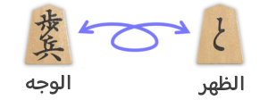
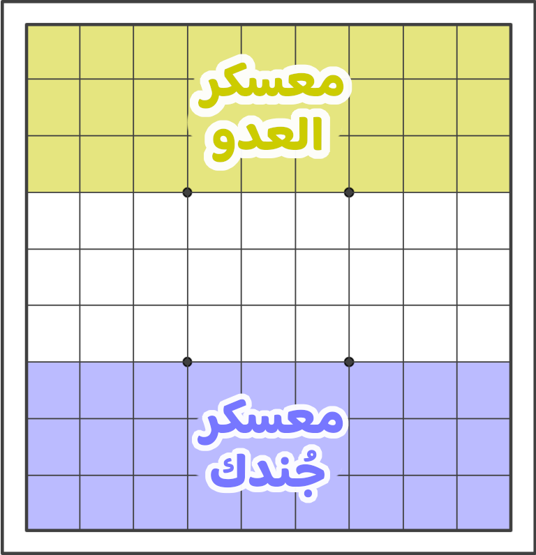
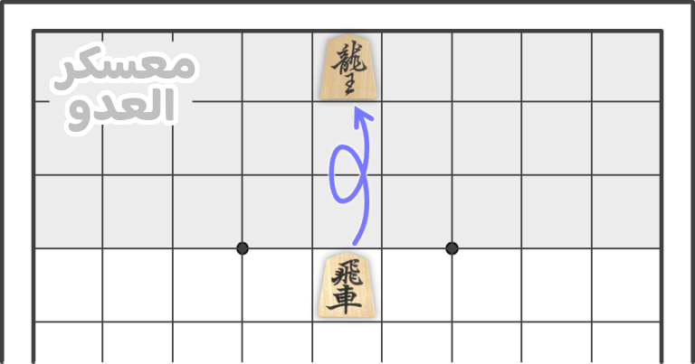
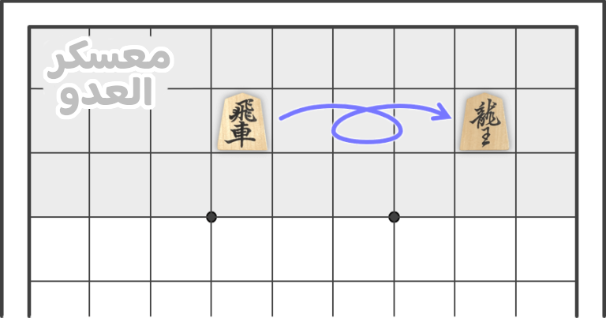
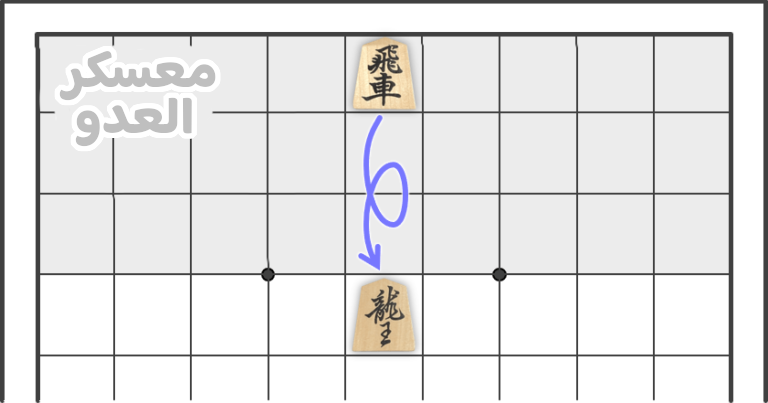
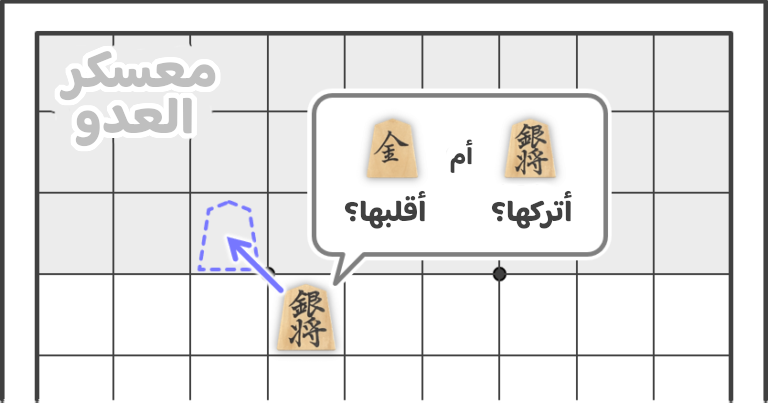

+++
title = "الترقّي"
description = "ما يجب في الترقّي."
[extra]
banner = "banner.webp"
accent_color = "#d8ac6c"
accent_color_dark = "#d8ac6c"
toc = true
+++

<h2 style="text-align:center">السلام عليكم ورحمة الله وبركاته</h2>

للقطع رموزٌ على وجهها وظهرها، ولكلّ رمزٍ حركة. ويختلف رمز الوجه عن الظهر؛ فرمز أوّلها يُسمى **اسم وجهها**، وإن قُلبت **ترقّت** ويُسمى رمزها الثاني هنا **باسم ظهرها**.

وتكون القطع أوّل اللعب على ظهرها -أي بوجهها- وإن جئت بشروط الترقّي قلبتها. ويُكسبك هذا حركات أكثر ونطاقًا أوسع لقطعك.

وكلّ القطع تُقلب ماعدا الملك والوزير الأوّل، فلا رموز على ظهر هذه القطع.

## معسكرك ومعسكر العدو

أوّل ثلاثة صفوف منك هي **معسكرك** وآخر ثلاثة هي **معسكر عدوّك**. وتُقلب القطع ترقيًا إن وصلت لمعسكر العدو. <small>ولا اسمًا معينًا لما بينهما من صفوف؛ أمّا عندي فهي «الساحة».</small>

## قواعد الترقّي وحالاته

ويكون بثلاث شروط، فإن حُصّلت صار الترقّي خيارًا، فإن شئت قلبتها، وإن شئت تركتها على حالها.

### أوّل حالة: عند دخولك معسكر العدو

تَقلب قطعتك إن شئت بتحريكها داخل معسكر العدو. ومثال هذا في الصورة؛ فيصير الرخ تنينًا، وبهذا الترقّي ينتهي دورك ويعود لخصمك كعادة اللعبة.

<figure>

  <figcaption>الترقّي بالدخول لمعسكر العدو من الساحة</figcaption>
</figure>

### ثاني حالة: داخل معسكر العدو

إن لم تقلب قطعتك أوّل دخولك لمعسكر العدو، تقلبها إن حركّتها في دور لاحق. كما في الصورة.

<figure>

  <figcaption>الترقّي داخل معسكر العدو</figcaption>
</figure>

### ثالث حالة: عند خروجك من معسكر العدو

تَقلب قطعتك إن شئت حين خروجك من معسكر العدو -إن لم تقلبها أوّل دخولك-؛ ومثال هذا في الصورة؛ فيصير الرخ تنينًا.

<figure>

  <figcaption>الترقّي بالخروج من معسكر العدو إلى الساحة</figcaption>
</figure>

## الترقّي ليس شرطًا

والقلب ليس شرطًا في أيّ من الحالات المذكورة، وهو من أمور الحرب والمكيدة، فيُفيدك في مواقع ويُنهيك في أخرى؛ ومثال هذا: والأحسن ألا تقلب الوزير الثاني، والفارس، والرامح، فتتغيّر حركاتهم ومنها يتغيّر أسلوب لعبك وقد يضرّك هذا.

إّلا أن القلب يزيد المبتدئ قوّة لقطعه، فيُفضل أن يقلب ما استطاع؛ إلى أن يصير عالمًا بأمر التّرقي ومتى ينفع ويضر.

<figure>

  <figcaption>خيار الترقّي والترك لك</figcaption>
</figure>

## سحب الترقّي

لا يُسمح برد القطعة لوجهها إن قلبتها، وتبقى في حالها لنهاية الشوط.