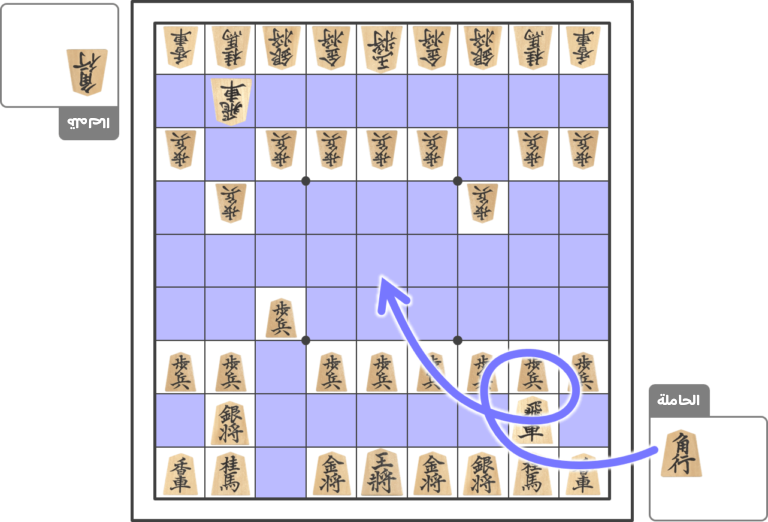

+++
title = "الأخذ والرد"
description = "طرق أخذ القطع واستعمالها."
[extra]
banner = "banner.jpg"
accent_color = "#d8ac6c"
accent_color_dark = "#d8ac6c"
toc = true
+++

<h2 style="text-align:center">السلام عليكم ورحمة الله وبركاته</h2>

تأخذ قطعة عدوّك إن كانت في مربع حركة قطعتك وتصير لك. وتضع ما أخذت على الحاملة.

واجعل القطع في مرأى عين خصمك؛ فكتم ما أخذت أدب سوء واستنقاص.

## إدخال الأخذ

إن أخذت قطعةً ضعها على حاملتك بحالها الأوّل -على ظهرها-، حتى وإن كنت قد أخذتها وهي في حالة ترقِّ.

فإن أخذت بيذقًا مُذهّب، تُقلبه على حاملتك بيذقًا عاديًا.

## استعمال المأخوذ من القطع

### أدخلها في أي مربع أدرت

تُدخل ما أردت من القطع في أي مربع فارغ. وبه ينتهي دورك دون تحريك آخر.

<figure>

  <figcaption>كلّ مربع ليس فيه قطعة فهو فارغ لك</figcaption>
</figure>

### لا تقلب

تُدخَل القطع بوجهها على ظهرها حتى وإن وُضعت داخل معسكر العدو.

<figure>

  <figcaption>توضع بوجهها حتى داخل معسكر العدو</figcaption>
</figure>

### كشّ بإدخال

يُباح لك كشّ ملك الخصم بوضع قطعتك في مربع يُهاجمه عند إدخالك لها. ويُحظر إن أدخلت بيذقًا؛ وسنأتي بتفصيل هذا.

