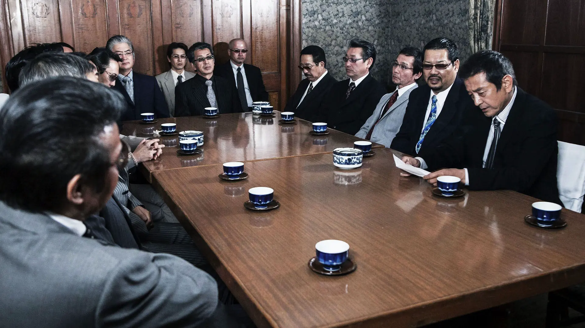
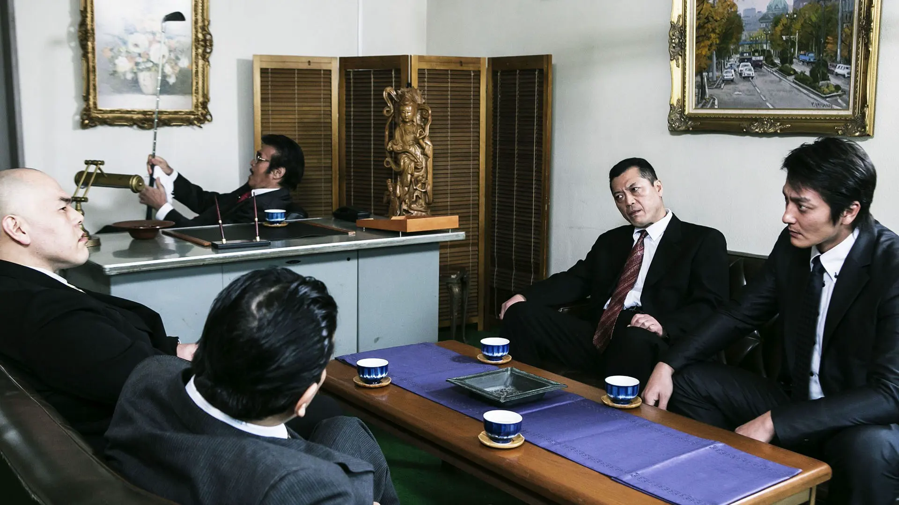
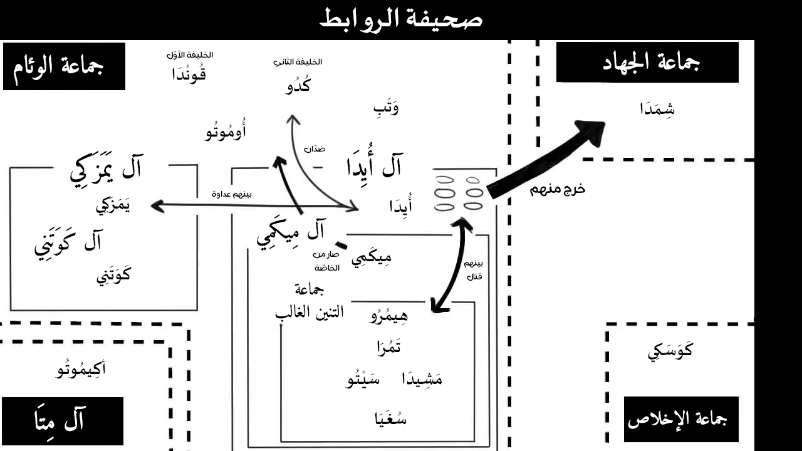

+++
title = "توحيد اليابان 2 - 日本統一2"
description = "الجزء الثاني من السلسلة."

[extra]
toc = true
banner = "banner.jpg"
accent_color = "#3c6c74"
accent_color_dark = "#3c6c74"
+++

<h2 style="text-align:center">السلام عليكم ورحمة الله وبركاته</h2>

<aside>

<figure>
   
  
  <figcaption>غلاف الفلم.</figcaption>
</figure>

**إخراج**: [يُوشِيهِيسَا يَمَمُوتُو](https://ja.wikipedia.org/wiki/%E5%B1%B1%E6%9C%AC%E8%8A%B3%E4%B9%85_(%E6%98%A0%E7%94%BB%E7%9B%A3%E7%9D%A3)) 

**كتابة**: [هِيرُويُكِي تْسُجِي](https://ja.wikipedia.org/wiki/%E8%BE%BB%E8%A3%95%E4%B9%8B)

**إنتاج**: شركة التقدم، 2013.

</aside>

## الملخّص

وقعت أحداث هذا الجزء بعد ثماني سنوات من الجزء الأوّل، فصار (هِيمُرُو) رديف آل (مِيكَمِي) وفي نفس المدة خرج (تَمُرَا) من السجن.

وتولّى الجماعة رئيس جديد وأُبعد (أُيِدَا) فثار وخرج عليهم ودبّر انقلابًا فيهم.

وتقلّب قلب (مِيكَمِي) فظهر كريم الطبع مع (هِيمُرُو) و(تَمُرَا) وقد أراد قتلهما في أوّل القصة.

### بعد ثماني سنوات | الجماعة الآن

تنحى (قُونْدَا) وصارت الرئاسة لخليفته (كُدُو).

خُيّر (هِيمُرُو) - كما ذُكر في الجزء الأوّل- بين الموت أو أن يصير من أصحاب الخُسّر. فاختار أن يكون منهم وجدّ في طلب المراتب حتى صار رديف زعيم آل (مِيكَمِي).

وزعيم آل (مِيكَمِي) هو (تِتْسُيَا مِيكَمِي)، ويتبع آل (أُيِدَا) وهما تحت جماعة الوئام؛ فيكونا (مِيكَمِي) و(هِيمُرُو) أتباعًا لـ(أُيِدَا) في الجماعة.

أما (كَوَتَنِي) فهو رديف زعيم آل (يَمَزَكِي)، ويُعرفون بشيعة (يَمَزَكِي).

وليس بين الطائفتين عداوة، فهما في نفس الجماعة ولكن بين زعيميها تنافس لأنهما في مكان يؤهلهما ليكون أحدهما رئيسًا بعد (كُدُو).

غير أن (أُيِدَا) من أهل الطريقة القديمة فلم يُحسن التكيّف مع تغيّر الزمن ففاته المجد والرفعة.

وعرض الرئيس (أُومُوتُو) على (مِيكَمِي) أن يكون من الخاصة، فيصير هو و(هيمورا) رديفين للجماعة، وهو منصب عال ورتبة عظيمة.

ولكن وفاءً لـ(أُيِدَا) رفض (مِيكَمِي) العرض.

وبما أن (أُيِدَا) في خلاف مع (كُدُو) و(يَمَزَكِي) فموقف آل (مِيكَمِي) سيصير هشَا، وإن أقدم (أُيِدَا) على الانقلاب فستكون نهاية آل (مِيكَمِي).

## شرح الروابط

## الملفات

[الفلم (مُترجَم)](https://mega.nz/file/Dc0RFZyL#-oO39v4uToA2P-HQh56LhaU6zbpnKl15jRWdsO2hMcw) - [ملف الترجمة](https://mega.nz/file/7YMgxSTC#EqcMplhGXvUgpjsAVGmeFVhfDCgSHxPuYUYOtj7x64o)

{{ youtube(id="3E8_3efCJJ4") }}

---